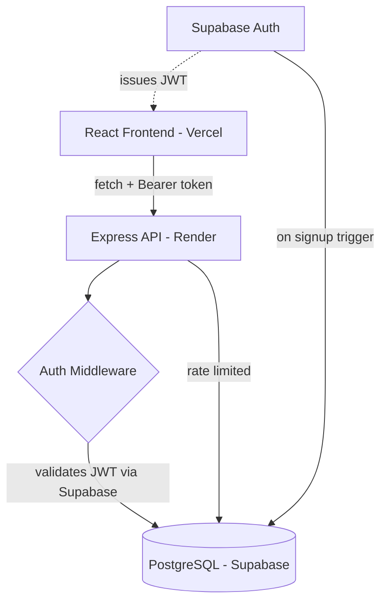

# DevMate — Find Your Team, Build Your Dream

A full stack collaboration platform where developers, designers and creators —
freshers and working professionals alike — post project ideas or collaboration
requests and find teammates with complementary skills to build them together,
whether paid, passion, or open source.

> 🔗 **Live:** [your-vercel-url.vercel.app](#) · **API:** [your-render-url.onrender.com](#)

---

## Overview

DevMate solves a simple problem: finding the right person to build something
with shouldn't be harder than the building itself. Users post a project with
the skills they need, others discover it through filters or search, apply with
a message, and the project owner reviews applications — all backed by a real
authenticated, rate-limited, production-deployed backend.

---

## Features

- 🔐 **Authentication** — Email/password sign-up and sign-in via Supabase Auth, with
  a database trigger that auto-creates a profile row the moment someone signs up
- 📝 **Post a Project** — Title, description, type (passion/paid/open-source/
  hackathon/startup), skills needed, experience level, industry, remote/in-person,
  team size
- 🔍 **Discover & Filter** — Filter by project type, experience level, and remote
  status; live search by title/description, all resolved server-side via dynamic
  parameterized SQL
- 🤝 **Apply to Collaborate** — Send an application with a message; applications
  are tied to the authenticated user, not a client-supplied ID
- 👤 **Profiles** — Bio, location, skills, GitHub/LinkedIn links, and a list of
  projects the user has posted; fully editable
- 📄 **Project Detail Pages** — Dedicated route per project (`/projects/:id`)
  showing full details and who posted it
- ⚡ **Live Feed Updates** — Newly posted projects appear in the feed instantly,
  no refresh needed

---

## Tech Stack

| Layer | Technology |
|---|---|
| Frontend | React (Vite), React Router, Tailwind CSS |
| Backend | Node.js, Express.js |
| Database | PostgreSQL (Supabase) |
| Auth | Supabase Auth — JWT-based |
| Deployment | Vercel (frontend), Render (backend) |
| Tooling | Git, GitHub, Postman, Cursor |

---

## Architecture



**Request flow for a protected action (e.g. posting a project):**

```
Browser → attaches Supabase JWT as Bearer token
   → Express route-level rate limiter
   → auth middleware validates token against Supabase
   → req.user.id used as owner_id (never trusted from request body)
   → parameterized SQL INSERT
   → response → instant UI update, no refresh
```

---

## Security

This wasn't an afterthought — every route went through a real review pass
(GitHub Advanced Security / CodeQL) and was fixed accordingly:

- **JWT authentication middleware** — every protected route validates the
  Supabase access token server-side before touching the database
- **Ownership checks (IDOR fix)** — a user can only read/update their *own*
  profile (`req.user.id === req.params.id`), not anyone else's by guessing an ID
- **Server-derived identity** — `owner_id` on projects and `applicant_id` on
  applications are taken from the verified token, never from the request body,
  preventing identity spoofing
- **Rate limiting** — every database-hitting route (`projects`, `applications`,
  `users`) is protected with `express-rate-limit`
- **Parameterized, static SQL** — filters use a single fixed query with
  `($n IS NULL OR column = $n)` patterns instead of string-concatenated SQL,
  closing a CodeQL-flagged SQL injection vector
- **Production hardening** — `trust proxy` enabled for correct rate-limiting
  behind Render's load balancer, SSL enforced on the Postgres connection in
  production, and CORS locked to an explicit origin allowlist

---

## Database Schema

| Table | Purpose |
|---|---|
| `users` | Profile data — bio, location, skills, GitHub/LinkedIn, auto-created via trigger on signup |
| `projects` | Posted collaboration requests with type, skills, experience level, location |
| `applications` | Applications submitted to a project, tied to the authenticated applicant |
| `messages` | Schema in place for in-app messaging between matched users *(coming soon)* |
| `reviews` | Schema in place for post-collaboration ratings *(coming soon)* |

---

## Project Structure

```
DevMate/
├── client/
│   └── src/
│       ├── components/      # Navbar, ProjectCard
│       ├── pages/           # Home, Auth, PostProject, ProjectDetail, Profile
│       ├── lib/api.js       # API base URL + auth header helper
│       └── supabase.js      # Supabase client config
├── server/
│   ├── routes/              # projects, applications, users
│   ├── middleware/auth.js   # JWT validation middleware
│   ├── db/index.js          # PostgreSQL connection pool
│   └── index.js             # Express app entry point
└── README.md
```

---

## Running Locally

**Backend:**
```bash
cd server
npm install
npm run dev      # http://localhost:5000
```

**Frontend:**
```bash
cd client
npm install
npm run dev      # http://localhost:5173
```

Create a `.env` in `server/` with:
```
DATABASE_URL=
SUPABASE_URL=
SUPABASE_ANON_KEY=
ALLOWED_ORIGINS=http://localhost:5173
```

---

## Roadmap

- [ ] In-app messaging between matched users
- [ ] Ratings & reviews after a collaboration ends
- [ ] Google & GitHub OAuth sign-in
- [ ] Badges for completed projects

---

## Author

**Gyanesh Singh** — [GitHub](https://github.com/gyanesh753)
